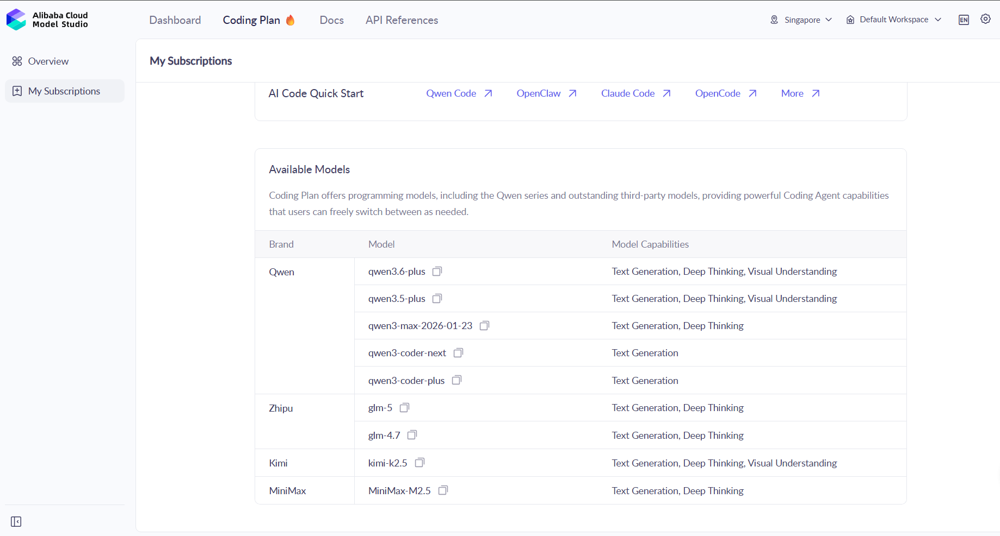
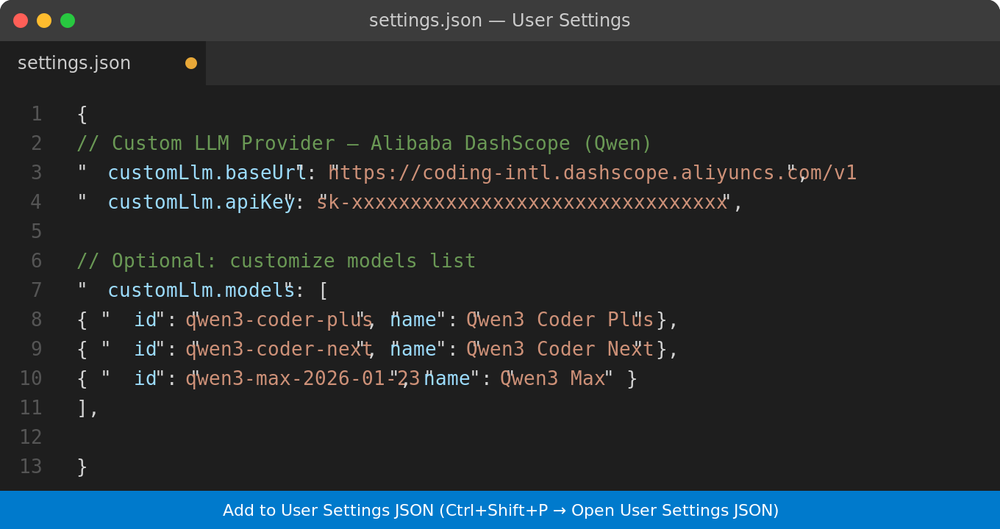
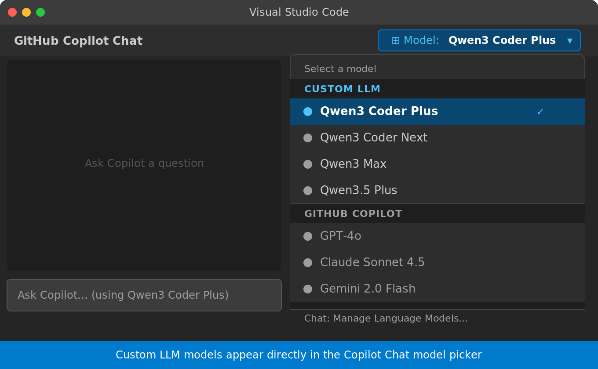
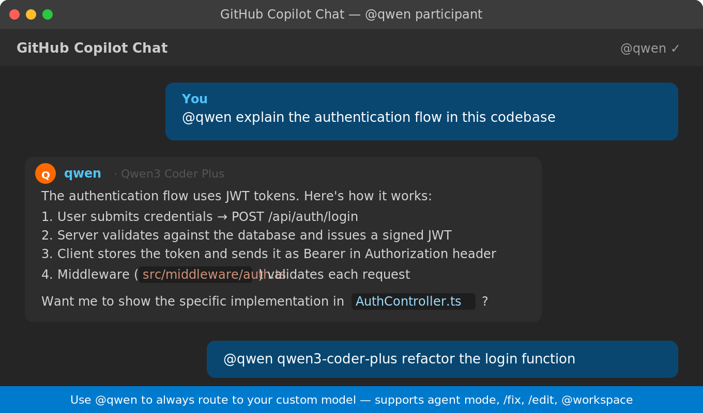

# Custom LLM Provider

Connect any **OpenAI-compatible** AI endpoint to GitHub Copilot Chat in Visual Studio Code.  
Works out of the box with **Alibaba DashScope (Qwen)**, OpenRouter, and any other OpenAI-compatible API.

[](LICENSE)
[](https://marketplace.visualstudio.com/items?itemName=MartinRiha.vscode-custom-llm-provider)
[](CHANGELOG.md)

---

## 🎯 Primary Use Case — Alibaba Cloud Coding Plan

This extension was developed primarily to bring **[Alibaba Cloud Coding Plan](https://modelstudio.console.alibabacloud.com/ap-southeast-1?tab=coding-plan#/efm/coding-plan-index)** into Visual Studio Code.

Alibaba's Coding Plan feature in Model Studio lets you run powerful **Qwen Coder** models in full agent mode — editing files, running tests, searching your codebase — all from within GitHub Copilot Chat. This extension bridges the gap by exposing those models directly in the VS Code model picker.



---

## ✨ Features

- Models appear directly in the **Copilot Chat model picker** — no extra setup
- **`@qwen` chat participant** (opt-in) — type `@qwen` in any chat turn to route just that message through your custom model
- **Multi-provider support** — connect Alibaba DashScope, OpenRouter, and any other provider simultaneously, each with its own URL and API key
- **Dynamic model discovery** — models are fetched automatically from each provider's `/v1/models` endpoint on startup
- **Image input support** — attach images directly in Copilot Chat (requires a multimodal model such as `qwen-vl-max`)
- Full streaming support (Server-Sent Events)
- **Tool calling support** — agent mode, `/fix`, `/edit`, `@workspace` all work
- **Automatic retry with exponential backoff** for network failures and rate limits
- Hot-reload on settings change — no restart needed
- Zero runtime dependencies

---

## 🚀 Quick Start

### 1. Add your first provider

Open the Command Palette (`Ctrl+Shift+P`) and run **Custom LLM: Add provider**.

The wizard will ask for:
1. **Provider name** — e.g. `Alibaba DashScope`
2. **Base URL** — e.g. `https://coding-intl.dashscope.aliyuncs.com/v1`
3. **API key** — your `sk-…` key

After saving, the extension automatically fetches available models from the provider.



> **Get your API key** from [Alibaba Cloud Model Studio](https://modelstudio.console.alibabacloud.com) → API Keys section.  
> Note that Coding Plan API keys are separate from regular DashScope keys.

### 2. Pick a model in Copilot Chat

Open Copilot Chat (`Ctrl+Alt+I`) → click the model name → your models appear under **Custom LLM**.

> **First time only:** Open `Ctrl+Shift+P` → **Chat: Manage Language Models** → hover over each model → click the **eye icon 👁** to enable it in the picker.



### 3. Use the `@qwen` participant (optional)

Type `@qwen` at the start of a message to route **that single turn** through your custom model — regardless of which model is selected in the picker.

```
@qwen explain the auth flow in this codebase
@qwen qwen3-coder-plus refactor this function
```

> **Per-turn, not sticky:** since v0.4.5 the participant is **not sticky** — you have to type `@qwen` every time you want it. Without `@qwen`, the message goes to whatever model you picked in the model picker (including original GitHub Copilot models like GPT-4 or Claude). This prevents the participant from accidentally hijacking native Copilot turns. If you want to always use your custom model, select it in the picker instead.



---

## 🌐 Supported Endpoints

| Provider | Base URL |
|----------|----------|
| Alibaba DashScope (international) | `https://coding-intl.dashscope.aliyuncs.com/v1` |
| Alibaba DashScope (standard) | `https://dashscope.aliyuncs.com/compatible-mode/v1` |
| OpenRouter | `https://openrouter.ai/api/v1` |
| Any OpenAI-compatible API | custom URL |

---

## 🔌 Multi-Provider Support

You can connect **multiple providers at once** — for example, use Alibaba DashScope and OpenRouter side by side. Each provider has its own URL and API key; models from all providers are merged into a single list in the Copilot Chat picker.

**Add a provider:**
```
Ctrl+Shift+P → Custom LLM: Add provider
```

**Manage providers (edit / remove):**
```
Ctrl+Shift+P → Custom LLM: Manage providers
```

**Refresh the model list:**
```
Ctrl+Shift+P → Custom LLM: Refresh model list from API
```

---

## ⚙️ Settings

### Provider configuration

Providers are stored in the `customLlm.providers` array. Each entry has three fields:

| Field | Description |
|-------|-------------|
| `name` | Display name shown in info messages (e.g. `"Alibaba DashScope"`) |
| `baseUrl` | Base URL ending with `/v1` |
| `apiKey` | API key (`sk-…`). Leave empty if not required. |

You can also edit settings directly in **User Settings JSON** (`Ctrl+Shift+P` → `Open User Settings (JSON)`):

```json
"customLlm.providers": [
  {
    "name": "Alibaba DashScope",
    "baseUrl": "https://coding-intl.dashscope.aliyuncs.com/v1",
    "apiKey": "sk-YOUR-KEY-HERE"
  },
  {
    "name": "OpenRouter",
    "baseUrl": "https://openrouter.ai/api/v1",
    "apiKey": "sk-or-YOUR-KEY-HERE"
  }
]
```

> **Legacy settings** (`customLlm.baseUrl` and `customLlm.apiKey`) are automatically migrated to the new `customLlm.providers` format on the first startup after updating to v0.4.0. No manual action needed.

### Model list

`customLlm.models` is auto-populated by model discovery and does not normally need to be edited manually. The extension merges discovered models with any existing entries — custom entries are preserved.

### Default models

If no providers are configured or the API is unreachable, the extension falls back to these built-in defaults (all available in [Alibaba Cloud Coding Plan](https://modelstudio.console.alibabacloud.com/ap-southeast-1?tab=coding-plan#/efm/coding-plan-index)):

| Model ID | Display Name | Provider | Context |
|----------|-------------|----------|---------|
| `qwen3-coder-plus` | Qwen3 Coder Plus | Alibaba | 128K |
| `qwen3-coder-next` | Qwen3 Coder Next | Alibaba | 128K |
| `qwen3-max-2026-01-23` | Qwen3 Max | Alibaba | 128K |
| `qwen3.5-plus` | Qwen3.5 Plus | Alibaba | 1M |
| `qwen3.6-plus` | Qwen3.6 Plus | Alibaba | 1M |
| `glm-5` | GLM-5 | Zhipu | 200K |
| `glm-4.7` | GLM-4.7 | Zhipu | 128K |
| `kimi-k2.5` | Kimi K2.5 | Moonshot | 256K |
| `MiniMax-M2.5` | MiniMax M2.5 | MiniMax | 256K |

---

## 🛠️ Commands

| Command | Description |
|---------|-------------|
| `Custom LLM: Add provider` | Guided wizard to add a new provider (name → URL → API key → auto-discover models) |
| `Custom LLM: Manage providers` | List, edit, or remove configured providers |
| `Custom LLM: Refresh model list from API` | Manually re-fetch models from all configured providers |

---

## 📋 Requirements

- Visual Studio Code `1.104.0` or later
- GitHub Copilot extension installed and signed in (individual plan)
- An API key for your chosen provider

---

## 🔁 Retry Behavior

The extension automatically retries failed requests with **exponential backoff**:

| Retry | Delay | Triggered by |
|-------|-------|--------------|
| 1st | ~1 second | Rate limit (429), Server errors (5xx) |
| 2nd | ~2 seconds | Same as above |
| 3rd | ~4 seconds | Same as above |

Maximum delay capped at 10 seconds. Request cancellation is never retried.

---

## ⚠️ Known Limitations

- **GitHub Copilot Coding Plan** (GitHub's native multi-step agent mode) is tied to GitHub's own infrastructure and cannot use custom providers. Use [Alibaba Cloud Coding Plan](https://modelstudio.console.alibabacloud.com/ap-southeast-1?tab=coding-plan#/efm/coding-plan-index) as a powerful alternative.
- **Inline completions** (ghost text) are provided by GitHub Copilot and cannot be redirected
- Models only appear in the picker on **individual GitHub Copilot plans** (not Business/Enterprise)

---

## 🛠️ Troubleshooting

### Original Copilot models reply "no input given" / context fills to ~95% in a loop

Fixed in **v0.4.5**. In earlier versions, the `@qwen` participant was sticky, so once you used it, every subsequent message was silently routed through the participant — even when you switched the picker back to a built-in Copilot model (GPT-4, Claude, etc.). On agent-mode turns where the actual content was in references/tool results rather than plain prompt text, the participant forwarded an empty user message, the model replied "what do you need?", and the loop repeated until the context filled.

If you see this on **0.4.4 or earlier**, update to 0.4.5+. As a workaround on older versions, fully clear the `@qwen` mention from the prompt and reload the chat.

### Agent mode loops / repeating the same actions

If the model keeps calling the same tool in a loop, switch to a larger variant — smaller models sometimes struggle with complex multi-step tool orchestration. Try `qwen3-coder-plus` or `qwen3-max` instead of lighter models.

### Models don't appear in the picker

1. Open `Ctrl+Shift+P` → **Chat: Manage Language Models**
2. Hover over each model in the **Custom LLM** section
3. Click the **eye icon 👁** to make it visible in the picker

If the section doesn't appear at all, check that the extension is active: `Ctrl+Shift+P` → **Extensions: Show Installed Extensions** and verify **Custom LLM Provider** is enabled.

To force a model refresh: `Ctrl+Shift+P` → **Custom LLM: Refresh model list from API**.

### 401 Unauthorized — "invalid access token or token expired"

Your API key is missing or incorrect. Fix:

1. Open `Ctrl+Shift+P` → **Custom LLM: Manage providers**
2. Select your provider → **Edit**
3. Paste your API key (starts with `sk-`)
4. Make sure there are no extra spaces around the key

Get your key from [Alibaba Cloud Model Studio](https://modelstudio.console.alibabacloud.com) → **API Keys** section.

### Requests fail with 404 or empty responses

Check that the `baseUrl` ends with `/v1` and the model `id` values match exactly what your provider expects. For DashScope, use `https://coding-intl.dashscope.aliyuncs.com/v1`.

### Settings changes not taking effect

The extension hot-reloads on settings change, but it may take a few seconds. If models still don't update, reload the VS Code window: `Ctrl+Shift+P` → **Developer: Reload Window**.

### Image attachment returns an error

Not all models support image input. If you see `"This model does not support image input"`, switch to a multimodal model. For Alibaba DashScope, `qwen-vl-max` supports vision. Coding-focused models (`qwen3-coder-*`, `qwen3.6-plus`, etc.) are text-only.

### Migrating from v0.3.x or earlier

The old `customLlm.baseUrl` and `customLlm.apiKey` settings are automatically migrated to the new `customLlm.providers` array on the first launch. If you need to re-run migration manually, remove the `customLlm.providers` entry from your settings and reload VS Code.

---

## 🔨 Building from Source

```bash
# Clone the repository
git clone https://github.com/milhaus123/vscode-custom-llm-provider.git
cd vscode-custom-llm-provider

# Install dev dependencies
npm install

# Compile TypeScript
npm run compile

# Package as .vsix
npx vsce package

# Install locally
code --install-extension vscode-custom-llm-provider-*.vsix
```

---

## 💖 Support the Project

If this extension saves you time, consider buying me a coffee!

[](https://ko-fi.com/martinriha)
[](https://github.com/sponsors/milhaus123)

Your support helps keep the project maintained and updated with new model releases. 🙏

---

## 📄 License

[MIT](LICENSE) © 2026 Martin Říha
