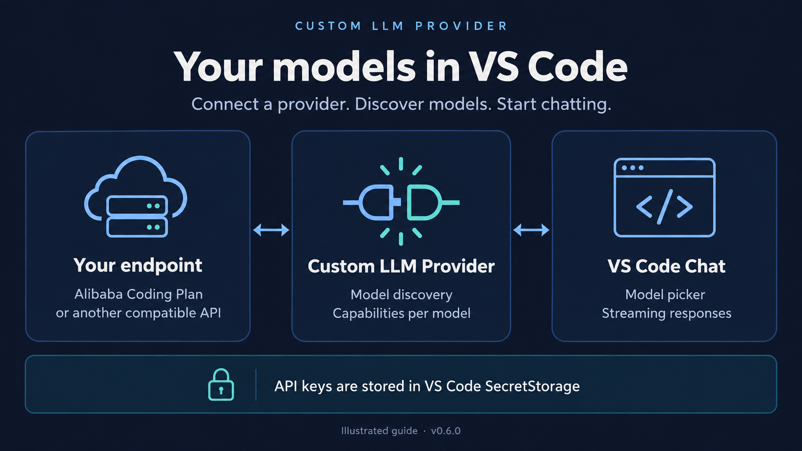
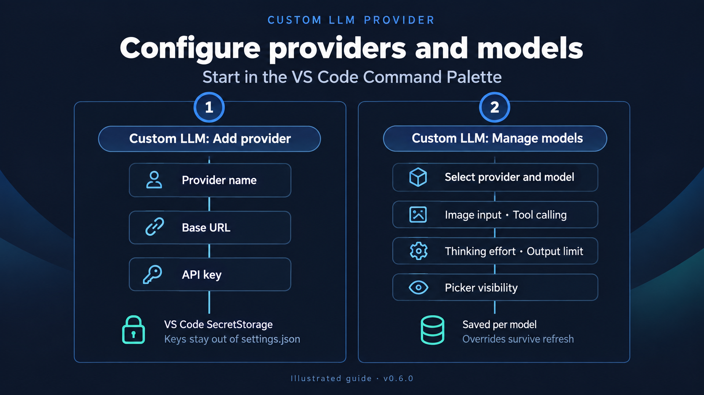
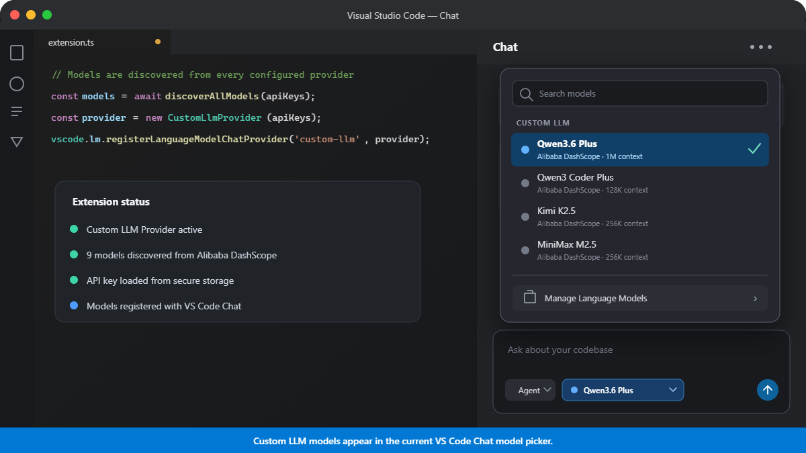
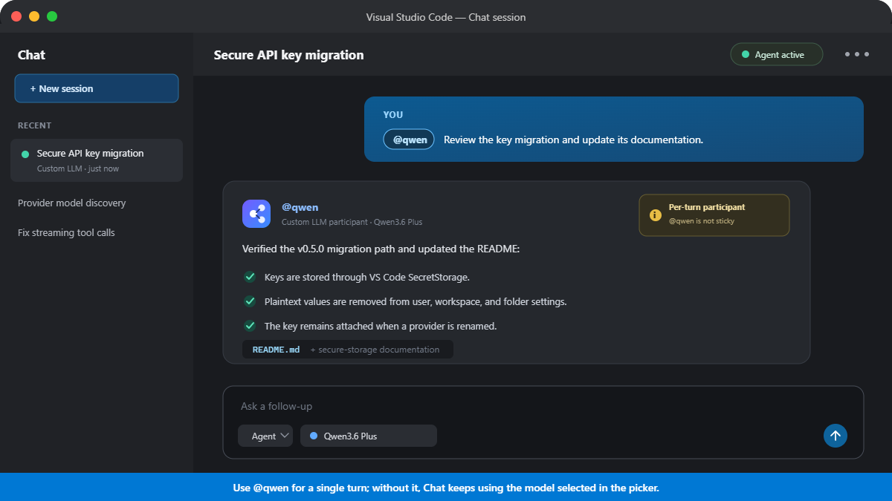

# Custom LLM Provider

Connect any **OpenAI-compatible** AI endpoint to GitHub Copilot Chat in Visual Studio Code.  
Works out of the box with **Alibaba DashScope (Qwen)**, **MiniMax**, **OpenRouter**, **Ollama**, **LiteLLM**, **vLLM**, and any other API that speaks the OpenAI `/v1/chat/completions` format — including self-hosted models.

[](LICENSE)
[](https://marketplace.visualstudio.com/items?itemName=MartinRiha.vscode-custom-llm-provider)
[](CHANGELOG.md)
[](https://ko-fi.com/martinriha)
[](https://github.com/sponsors/milhaus123)

---

## 🆕 What's New in v0.5.4

- **Thinking / reasoning effort control** — a new `customLlm.thinkingEffort` setting (`auto` | `off` | `low` | `medium` | `high`, default `auto`) controls how deeply a model reasons before answering. Add `"thinkingEffort": "<value>"` to a `customLlm.models` entry for a per-model override.
  - **Qwen / DashScope** (`qwen*`) → `enable_thinking` + `thinking_budget` (1 024 / 8 192 / 32 768 tokens for low / medium / high)
  - **OpenAI o-series, DeepSeek-V4, GPT-5** → `reasoning_effort: "low" | "medium" | "high"`
  - **All other providers** → silently ignored

See the [changelog](CHANGELOG.md) for complete release notes.

---

## 🆕 What's New in v0.5.3

- **Hide models from the picker** — set `"hidden": true` on an entry in `customLlm.models`. Unlike deleting it, which the next refresh undoes, a hidden model stays hidden.
- **Non-chat models filtered automatically** — text-to-speech, image, video, embedding and rerank models are hidden on first discovery when the endpoint reports a mode (LiteLLM). Your own choice always wins on later refreshes.

See the [changelog](CHANGELOG.md) for complete release notes.

---

## 🆕 What's New in v0.5.2

- **`maxOutputTokens` finally works** — requests were capped at 8192 no matter what the setting said, which left reasoning models returning empty content. The configured value is now sent as-is.
- **Token limits read correctly from proxies** — `max_output_tokens` from LiteLLM's `/model/info` is picked up, and namespaced IDs such as `tensorix/z-ai/glm-5.2` match the built-in limits table instead of silently falling back to 8192.
- **Refreshes no longer reset hand-tuned limits** — a value you set by hand survives model discovery.
- **Clearer empty-response diagnostics** — the warning reports the `max_tokens` actually sent instead of the configured value.

See the [changelog](CHANGELOG.md) for complete release notes.

---

## 🆕 What's New in v0.5.1

- **Tool-result images now reach multimodal models** — screenshots and other images returned by tools are forwarded in a compatible follow-up message instead of being dropped.
- **Mixed tool results are preserved** — textual and JSON data returned alongside tool calls are decoded and sent to the model.
- **More accurate vision errors** — unrelated `400` responses are no longer misreported as missing image support.
- **Per-model vision control** — set `"imageInput": false` on a text-only model; LiteLLM's `supports_vision` metadata is detected automatically.
- **Better diagnostics** — request logs show whether image content was sent.

See the [changelog](CHANGELOG.md) for complete release notes.

---

## 🎯 Primary Use Case — Alibaba Cloud Coding Plan

This extension was developed primarily to bring **[Alibaba Cloud Coding Plan](https://modelstudio.console.alibabacloud.com/ap-southeast-1?tab=coding-plan#/efm/coding-plan-index)** into Visual Studio Code.

Alibaba's Coding Plan feature in Model Studio lets you run powerful **Qwen Coder** models in full agent mode — editing files, running tests, searching your codebase — all from within GitHub Copilot Chat. This extension bridges the gap by exposing those models directly in the VS Code model picker.



---

## ✨ Features

- Models appear directly in the **Copilot Chat model picker** — no extra setup
- **`@qwen` chat participant** (opt-in) — type `@qwen` in any chat turn to route just that message through your custom model
- **Multi-provider support** — connect Alibaba DashScope, MiniMax, OpenRouter, and any other provider simultaneously, each with its own URL and API key
- **Secure API key storage** — keys are kept in VS Code's encrypted `SecretStorage` instead of provider settings
- **Dynamic model discovery** — models are fetched automatically from each provider's `/v1/models` (or `/model/info` for LiteLLM-compatible endpoints) on startup
- **Stable provider IDs** — providers are identified by a human-readable slug (e.g. `alibaba-dashscope`), so renaming or changing a provider's URL never breaks the model list
- **Image input support** — attach images directly in Copilot Chat (requires a multimodal model such as `qwen-vl-max`)
- **Tool-result image support** — screenshots and other images returned by tools are forwarded to multimodal models
- Full streaming support (Server-Sent Events)
- **Tool calling support** — agent mode, `/fix`, `/edit`, `@workspace` all work
- **Automatic retry with exponential backoff** for network failures and rate limits
- Hot-reload on settings change — no restart needed
- Zero runtime dependencies

---

## 🚀 Quick Start

**Install from the VS Code Marketplace:**
[Custom LLM Provider](https://marketplace.visualstudio.com/items?itemName=MartinRiha.vscode-custom-llm-provider) — or search for **"Custom LLM Provider"** in the VS Code Extensions panel (`Ctrl+Shift+X`).

### 1. Add your first provider

Open the Command Palette (`Ctrl+Shift+P`) and run **Custom LLM: Add provider**.

The wizard will ask for:

1. **Provider name** — e.g. `Alibaba DashScope`
2. **Base URL** — e.g. `https://coding-intl.dashscope.aliyuncs.com/v1`
3. **API key** — your `sk-…` key

After saving, the extension automatically fetches available models from the provider.

The API key is stored in VS Code's encrypted secret storage, not in your user or workspace `settings.json`.



> **Get your API key** from [Alibaba Cloud Model Studio](https://modelstudio.console.alibabacloud.com) → API Keys section.  
> Note that Coding Plan API keys are separate from regular DashScope keys.

### 2. Pick a model in Copilot Chat

Open Copilot Chat (`Ctrl+Alt+I`) → click the model name → your models appear under **Custom LLM**.

> **First time only:** Open `Ctrl+Shift+P` → **Chat: Manage Language Models** → hover over each model → click the **eye icon 👁** to enable it in the picker.



### 3. Use the `@qwen` participant (optional)

Type `@qwen` at the start of a message to route **that single turn** through your custom model — regardless of which model is selected in the picker.

```text
@qwen explain the auth flow in this codebase
@qwen qwen3-coder-plus refactor this function
```

> **Per-turn, not sticky:** since v0.4.5 the participant is **not sticky** — you have to type `@qwen` every time you want it. Without `@qwen`, the message goes to whatever model you picked in the model picker (including original GitHub Copilot models like GPT-4 or Claude). This prevents the participant from accidentally hijacking native Copilot turns. If you want to always use your custom model, select it in the picker instead.



---

## 🌐 Supported Endpoints

| Provider | Base URL |
| -------- | -------- |
| Alibaba DashScope (international / Coding Plan) | `https://coding-intl.dashscope.aliyuncs.com/v1` |
| Alibaba DashScope (standard) | `https://dashscope.aliyuncs.com/compatible-mode/v1` |
| MiniMax ✅ | `https://api.minimaxi.chat/v1` |
| OpenRouter | `https://openrouter.ai/api/v1` |
| Ollama (local) | `http://localhost:11434/v1` |
| LiteLLM proxy | `http://localhost:4000/v1` |
| vLLM | `http://localhost:8000/v1` |
| Any OpenAI-compatible API | custom URL |

---

## 🔌 Multi-Provider Support

You can connect **multiple providers at once** — for example, use Alibaba DashScope and OpenRouter side by side. Each provider has its own URL and API key; models from all providers are merged into a single list in the Copilot Chat picker.

**Add a provider:**

```text
Ctrl+Shift+P → Custom LLM: Add provider
```

**Manage providers (edit / remove):**

```text
Ctrl+Shift+P → Custom LLM: Manage providers
```

**Refresh the model list:**

```text
Ctrl+Shift+P → Custom LLM: Refresh model list from API
```

---

## ⚙️ Settings

### Provider configuration

Providers are stored in the `customLlm.providers` array. Each entry has the following fields:

| Field | Description |
| ----- | ----------- |
| `id` | Auto-generated slug used as a stable internal identifier (e.g. `"alibaba-dashscope"`). Set automatically — you don't need to write this by hand. |
| `name` | Display name shown in the UI and info messages (e.g. `"Alibaba DashScope"`) |
| `baseUrl` | Base URL ending with `/v1` |

The `id` slug is derived from the provider name when you add it via the wizard. It stays stable even if you later rename the provider or change its URL — so the model list never gets orphaned, and the API key stays attached to the right provider.

You can also edit settings directly in **User Settings JSON** (`Ctrl+Shift+P` → `Open User Settings (JSON)`):

```json
"customLlm.providers": [
  {
    "id": "alibaba-dashscope",
    "name": "Alibaba DashScope",
    "baseUrl": "https://coding-intl.dashscope.aliyuncs.com/v1"
  },
  {
    "id": "minimax",
    "name": "MiniMax",
    "baseUrl": "https://api.minimaxi.chat/v1"
  },
  {
    "id": "openrouter",
    "name": "OpenRouter",
    "baseUrl": "https://openrouter.ai/api/v1"
  }
]
```

### 🔐 API keys (v0.5.0+)

Starting with v0.5.0, API keys are kept out of `settings.json` during normal operation. Keys are stored through VS Code's [`SecretStorage`](https://code.visualstudio.com/api/references/vscode-api#SecretStorage) API, which VS Code documents as encrypted. On desktop, VS Code uses Electron's `safeStorage`; the underlying implementation varies by platform.

Each key is stored under the provider's stable `id`, so renaming a provider or changing its endpoint keeps the key attached to the correct provider.

> `SecretStorage` is global to this extension on the current machine, not scoped to a workspace. Provider configurations that use the same `id` therefore share the same stored key.

Set or change a key through the UI:

```text
Ctrl+Shift+P → Custom LLM: Manage providers → <provider> → Edit API key
```

Leaving the input empty removes the stored key. Removing a provider deletes its key too.

Do not add an `apiKey` property to `customLlm.providers` manually. Because keys live outside settings, they are not exposed through user or workspace `settings.json`. VS Code does **not** sync `SecretStorage` across machines, so enter each key once per machine.

#### Upgrading to v0.5.0

On startup, the extension scans user, workspace, and workspace-folder configurations. Any non-empty `apiKey` found in `customLlm.providers` is stored in `SecretStorage`, then the `apiKey` property is removed from that settings scope. The same cleanup runs again if `customLlm.providers` is edited later. A notification reports how many keys were moved.

Existing provider entries without an `id` are upgraded automatically. Legacy `customLlm.baseUrl` / `customLlm.apiKey` settings (pre-v0.4.0) and the old `providerUrl` model field are migrated as well.

> A key that has already leaked into a committed `settings.json` should be rotated at the provider — migration removes the value locally, but cannot un-publish it.

### Model list

`customLlm.models` is auto-populated by model discovery and does not normally need to be edited manually. The extension merges discovered models with any existing entries — custom entries are preserved.

| Field | Description |
| ----- | ----------- |
| `id` | Model identifier sent to the provider |
| `name` | Display name shown in the model picker |
| `providerId` | Stable provider slug referenced by the model |
| `maxInputTokens` | Maximum input context reported to VS Code |
| `maxOutputTokens` | Output budget — reported to VS Code and sent as `max_tokens` on every request |
| `imageInput` | Optional vision override; use `false` for a text-only model |
| `hidden` | Optional; `true` keeps the model out of the Copilot model picker |

When `imageInput` is omitted, the model is treated as image-capable because the standard OpenAI-compatible `/models` response does not advertise vision support. LiteLLM-compatible `/model/info` responses can set this automatically through `supports_vision`.

#### Hiding models from the picker

Provider catalogues list more than chat models — text-to-speech, image and video generation, embeddings, rerankers. They cannot serve a chat request, so they only add noise to the model picker.

Set `"hidden": true` on any entry to keep it out of the picker:

```json
{
  "id": "qwen-tts",
  "name": "Qwen Tts",
  "providerId": "alibaba-dashscope",
  "maxInputTokens": 131072,
  "maxOutputTokens": 8192,
  "hidden": true
}
```

Hide rather than delete: a deleted entry is added back by the next model refresh, a hidden one stays hidden. Hiding only affects the picker — the entry stays in your settings, so a chat already using that model keeps working, and `"hidden": false` brings it straight back.

Endpoints that report a model's mode — LiteLLM's `/model/info` — get this for free: models whose `mode` is not `chat` or `completion`, and deployments the proxy marks as `blocked`, are hidden the first time they are discovered. Only the first time: once an entry exists, the flag is yours, so unhiding one is never undone by a refresh. Plain OpenAI-compatible `/models` responses (Alibaba DashScope among them) carry no mode at all, so nothing is hidden automatically there — set the flag by hand.

#### Output budget and reasoning models

`maxOutputTokens` is sent verbatim as `max_tokens`. Reasoning models (GLM, Qwen thinking modes, DeepSeek-R1, QwQ …) spend that budget on their chain of thought before writing any answer, so a budget that is too small produces a reply with no content at all. If **View → Output → Custom LLM** shows

```text
⚠️  EMPTY CONTENT — model produced 27615 chars of reasoning but 0 chars of content.
```

raise `maxOutputTokens` for that model; 32768 or more suits most reasoning models. The request log line shows the value actually sent as `max_tokens=…`.

Discovery fills the field in from the endpoint when it reports one — `max_output_tokens` or `max_tokens` from LiteLLM's `/model/info`, `max_completion_tokens` or `context_length` from `/models`. When the endpoint reports nothing, a value you set by hand is kept as-is across refreshes; only models the extension has never seen a limit for fall back to a built-in guess.

> **Editing over Remote SSH:** `customLlm.models` is a user setting, so it lives on whichever machine runs the extension host. In a Remote SSH window that is the **remote** host — edit it there, not in your local `settings.json`.

### Default models

If no providers are configured and the model list is empty, the extension adds these built-in defaults (all available in [Alibaba Cloud Coding Plan](https://modelstudio.console.alibabacloud.com/ap-southeast-1?tab=coding-plan#/efm/coding-plan-index)):

| Model ID | Display Name | Provider | Context |
| -------- | ----------- | -------- | ------- |
| `qwen3-coder-plus` | Qwen3 Coder Plus | Alibaba DashScope | 128K |
| `qwen3-coder-next` | Qwen3 Coder Next | Alibaba DashScope | 128K |
| `qwen3-max-2026-01-23` | Qwen3 Max | Alibaba DashScope | 128K |
| `qwen3.5-plus` | Qwen3.5 Plus | Alibaba DashScope | 1M |
| `qwen3.6-plus` | Qwen3.6 Plus | Alibaba DashScope | 1M |
| `glm-5` | GLM-5 | Zhipu | 200K |
| `glm-4.7` | GLM-4.7 | Zhipu | 128K |
| `kimi-k2.5` | Kimi K2.5 | Moonshot | 256K |
| `MiniMax-M2.5` | MiniMax M2.5 | MiniMax ✅ | 256K |

> **MiniMax** models (`MiniMax-M2.5` and others) are fully supported — connect via `https://api.minimaxi.chat/v1` with your MiniMax API key.

---

## 🛠️ Commands

| Command | Description |
| ------- | ----------- |
| `Custom LLM: Add provider` | Guided wizard to add a new provider (name → URL → API key → auto-discover models) |
| `Custom LLM: Manage providers` | List, edit, or remove configured providers |
| `Custom LLM: Refresh model list from API` | Manually re-fetch models from all configured providers |
| `Custom LLM: Test connection` | Send a test request to each configured provider and report the result |

---

## 📋 Requirements

- Visual Studio Code `1.119.0` or later
- GitHub Copilot extension installed and signed in (individual plan)
- An API key if your chosen provider requires authentication

---

## 🔁 Retry Behavior

The extension automatically retries failed requests with **exponential backoff**:

| Retry | Delay | Triggered by |
| ----- | ----- | ------------ |
| 1st | ~1 second | Rate limit (429), Server errors (5xx) |
| 2nd | ~2 seconds | Same as above |
| 3rd | ~4 seconds | Same as above |

Maximum delay capped at 10 seconds. Request cancellation is never retried.

---

## ⚠️ Known Limitations

- **GitHub Copilot Coding Plan** (GitHub's native multi-step agent mode) is tied to GitHub's own infrastructure and cannot use custom providers. Use [Alibaba Cloud Coding Plan](https://modelstudio.console.alibabacloud.com/ap-southeast-1?tab=coding-plan#/efm/coding-plan-index) as a powerful alternative.
- **Inline completions** (ghost text) are provided by GitHub Copilot and cannot be redirected
- Models only appear in the picker on **individual GitHub Copilot plans** (not Business/Enterprise)

---

## 🛠️ Troubleshooting

### Models lose their provider after changing a provider's URL (pre-v0.5.0)

Fixed in **v0.5.0**. Providers now have a stable slug `id` (e.g. `"alibaba-dashscope"`) that models reference instead of the raw endpoint URL. Changing a provider's URL no longer orphans its models. Existing configs are migrated automatically on first launch.

### "Add Models" → "Custom LLM" shows no input dialogs (v0.4.8)

Fixed in **v0.4.8**. In earlier versions, clicking **Add Models → Custom LLM** in the Copilot model picker opened the management command, but the name / URL / API key dialogs immediately disappeared without any input. The root cause was that VS Code 1.104+ keeps the model-picker webview in focus when it invokes the `managementCommand`, causing any synchronous `showInputBox` call to be dismissed as soon as the webview stole focus back. The fix adds a short settle-time so the picker panel fully closes before the first input dialog opens.

### Custom model can't be invoked — Copilot loops on `gpt-4o-mini` requests (v0.4.7)

Fixed in **v0.4.7**. If a custom model appeared to do nothing and VS Code kept sending auxiliary `gpt-4o-mini` (`*.copilotmd`) requests in a loop, the extension was inadvertently writing model IDs into Copilot's BYOK settings (`github.copilot.chat.customOAIModels`). When Copilot found the same ID in both registrations, it routed via BYOK, found no API key there, and silently looped. The fix removes that secondary write entirely. The extension also cleans up stale BYOK entries left by earlier versions on startup.

### Original Copilot models reply "no input given" / context fills to ~95% in a loop

Fixed in **v0.4.5**. In earlier versions, the `@qwen` participant was sticky, so once you used it, every subsequent message was silently routed through the participant — even when you switched the picker back to a built-in Copilot model (GPT-4, Claude, etc.). On agent-mode turns where the actual content was in references/tool results rather than plain prompt text, the participant forwarded an empty user message, the model replied "what do you need?", and the loop repeated until the context filled.

If you see this on **0.4.4 or earlier**, update to 0.4.5+. As a workaround on older versions, fully clear the `@qwen` mention from the prompt and reload the chat.

### Agent mode loops / repeating the same actions

If the model keeps calling the same tool in a loop, switch to a larger variant — smaller models sometimes struggle with complex multi-step tool orchestration. Try `qwen3-coder-plus` or `qwen3-max` instead of lighter models.

### Models don't appear in the picker

1. Open `Ctrl+Shift+P` → **Chat: Manage Language Models**
2. Hover over each model in the **Custom LLM** section
3. Click the **eye icon 👁** to make it visible in the picker

If the section doesn't appear at all, check that the extension is active: `Ctrl+Shift+P` → **Extensions: Show Installed Extensions** and verify **Custom LLM Provider** is enabled.

To force a model refresh: `Ctrl+Shift+P` → **Custom LLM: Refresh model list from API**.

### 401 Unauthorized — "invalid access token or token expired"

Your API key is missing or incorrect. Fix:

1. Open `Ctrl+Shift+P` → **Custom LLM: Manage providers**
2. Select your provider → **Edit API key**
3. Paste your API key (starts with `sk-`)
4. Make sure there are no extra spaces around the key

Get your key from [Alibaba Cloud Model Studio](https://modelstudio.console.alibabacloud.com) → **API Keys** section.

### Requests fail with 404 or empty responses

Check that the `baseUrl` ends with `/v1` and the model `id` values match exactly what your provider expects. For DashScope, use `https://coding-intl.dashscope.aliyuncs.com/v1`.

### Settings changes not taking effect

The extension hot-reloads on settings change, but it may take a few seconds. If models still don't update, reload the VS Code window: `Ctrl+Shift+P` → **Developer: Reload Window**.

### Inspect request diagnostics

Open **View → Output** and select **Custom LLM**. Each request includes the selected model, timing, streamed content and tool-call counts, finish reason, and whether images were included. Token usage is logged as structured JSON when the provider reports it.

### Image attachment returns an error

Not all models support image input. If you see `"This model does not support image input"`, switch to a multimodal model. For Alibaba DashScope, `qwen-vl-max` supports vision. Coding-focused models (`qwen3-coder-*`, `qwen3.6-plus`, etc.) are text-only.

Because an OpenAI-compatible endpoint doesn't generally advertise vision support, every model is offered to VS Code as image-capable unless the endpoint says otherwise (LiteLLM's `/model/info` reports `supports_vision`). To stop VS Code sending images to a model you know is text-only, set `"imageInput": false` on its entry in `customLlm.models` — the flag survives model refreshes.

### The model says it cannot see a screenshot from a tool

Images returned by tools (`#browser/screenshotPage` and similar) are forwarded to the model as a separate message right after the tool result, because the OpenAI chat schema only accepts plain text in a `tool` message. If the model still reports it cannot see the image, check **View → Output → Custom LLM**: the request line shows `images=yes` when image content was actually sent. If it shows `images=no`, VS Code never handed the image to the extension — verify the model's `imageInput` flag isn't set to `false`.

### Migrating from v0.4.x or earlier

Update to v0.5.0 and reload VS Code. Keys in v0.4.x `customLlm.providers` entries are moved to secret storage automatically. The older single-provider `customLlm.baseUrl` and `customLlm.apiKey` settings are also migrated, with the key stored securely.

If a migrated key is missing, do not put it back into `settings.json`. Run **Custom LLM: Manage providers**, select the provider, and choose **Edit API key**. You must also repeat this on each additional machine because VS Code does not sync secret storage.

---

## 🔨 Building from Source

```bash
# Clone the repository
git clone https://github.com/milhaus123/vscode-custom-llm-provider.git
cd vscode-custom-llm-provider

# Install the locked dependency versions
npm ci

# Compile TypeScript
npm run compile

# Package as .vsix
npx vsce package

# Install locally
code --install-extension vscode-custom-llm-provider-*.vsix
```

Maintainers can publish the current version with `npx vsce publish`, or increment and publish it in one step with `npx vsce publish patch`.

---

## 💖 Support the Project

If this extension saves you time, consider buying me a coffee!

[](https://ko-fi.com/martinriha)
[](https://github.com/sponsors/milhaus123)

Your support helps keep the project maintained and updated with new model releases. 🙏

---

## 📄 License

[MIT](LICENSE) © 2026 Martin Říha
